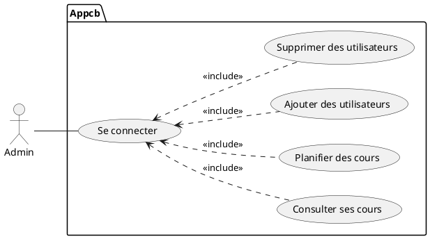
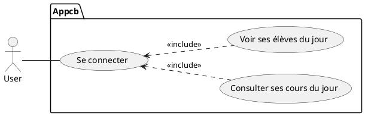

# Documentation de cbApp

Contexte : Pour faciliter la gestion des cours du cabinet, nous avons proposé à notre maitre de stage, une application C# permettant de gérer les cours d'anglais du jour avec un sysème d'authentification, afin que chaque personne du cabinet puissent utiliser le logiciel. 

## Base de données 
 ```sql
Drop database if exists dbappcb;
Create database dbappcb;
use dbappcb;

Create Table User(
    id integer not null auto_increment,
    nom varchar(50),
    prenom varchar(50),
    mdp varchar(100),
    administrator boolean,
    primary key(id)
);

Create  Table Cours(
    id integer not null auto_increment,
    nom varchar(100),
    idUser integer,
    ladate DateTime,
    primary key(id),
    foreign key (idUser) references User(id)
);

Create table Participe (
    idCours integer not null,
    idEleve integer not null,
    primary key(idCours,idEleve)
);

Create Table Eleve(
    id integer not null auto_increment,
    nom varchar(50),
    prenom varchar(50),
    mail varchar(50),
    telephone varchar(10),
    primary key(id)
);

insert into User (nom,prenom,mdp,administrator) values ('Cyril','admin','8296b82b0a068891c542086fe6f3a87d4c1de3536cf2c2f7d031872a10186ff1',1);
 ```
<br>

### Cas d'utilisations :





 Nous avons procédé, au hachage du mot de passe.

 Le mot passe admin en clair est Grizzli.

L'interface de connexion :

 

<br>

Je suis connecté en tant qu' administrateur.

J'ai le choix entre voir les cours du jour, voir les eleves ou les utilisateurs : 


<br>

Nous avons la liste des utilisateurs :

  

<br>

Nous allons ajouter un nouvel utilisateur :


<br>

Le nouvel utilisateur a bien été ajouté :


Nous revenons sur le menu principal et cliquons sur voir les cours :


Nous ajoutons un nouveau cours :


le cours a bien été ajouté :


Nous revenons sur le menu  principal et cliquons sur voir les elèves et cliquons sur ajouter :


<br>

<br>
 
 Nous pouvons voir les 2 élèves enregistrés, pour ajouter un nouvel élève cliquons sur Ajouter  :


Saisissons les informations :


<br>

Le nouvel élève a bien été ajouté :


En cliquant sur L'élève nous accèdons à sa fiche :


Nous revenons au menu principal et ajoutons cet élève au cours de Bob :


Nous cliquons sur ajouter, pour ajouter l'élève :


Chosissons Adam : 


L'élève a bien été inscrit :


Connectons nous en tant que Bob pour consulter ses cours.


Le cours du jour de Bob est "Essai de" pour le 18/12/2022 à 15 h :


Bob regarde les élèves de son cours, nous retrouvons Adam:


La fiche d'Adam :


Pour tester notre mot de passe, nous avons récupéré la somme de contrôle et mise sur Crackstation :


Le mot de passe admin a bien été retrouvé.

Pour remédier à cela, il faut premièrement sensibiliser les différents utilisateurs, pour qu'ils priviligienet des mots de passes forts. De plus nous allons procéder aus salage du mot de passe.


Le salage de mot de passe est une méthode pour rendre l'empreinte des mots de passe plus sûre en ajoutant aux mots de passe une chaîne de caractères aléatoires avant qu' ils soient hashés.

Le code permettant le salage, lors de la création d'un nouvel utilisateur :


Pour la phase de test nous hashons notre potentiel futur mot de passe :


La somme de contrôle du mot n'a pas été déterminée :


Code permettant le salage lors de l'authentification :


Tentative de connexion :


Résultat :


