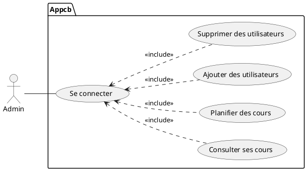
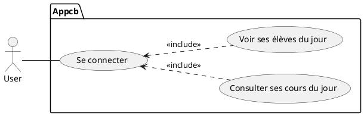

# Write-up cbApp

Context: To simplify the management of courses at the office, we proposed to our internship supervisor a C# application that manages the English lessons of the day with an authentication system, allowing each person in the office to use the software.

## Database
 ```sql
drop database if exists dbappcb;
Create database dbappcb;
use dbappcb;


Create Table user(
    id integer not null auto_increment,
    nom varchar(50),
    prenom varchar(50),
    mdp varchar(100),
    administrator boolean,
    primary key(id)
);

Create  Table cours(
    id integer not null auto_increment,
    nom varchar(100),
    idUser integer,
    ladate DateTime,
    primary key(id),
    foreign key (idUser) references user(id)
);

Create Table eleve(
    id integer not null auto_increment,
    nom varchar(50),
    prenom varchar(50),
    mail varchar(50),
    telephone varchar(10),
    primary key(id)
);

Create table participe (
    idCours integer not null,
    idEleve integer not null,
    primary key(idCours,idEleve),
    foreign key(idCours) references cours(id),
    foreign key(idEleve) references eleve(id)
);


insert into user (nom,prenom,mdp,administrator) values ('Cyril','admin','8296b82b0a068891c542086fe6f3a87d4c1de3536cf2c2f7d031872a10186ff1',1);
 ```
<br>

### Use cases :





We proceeded with password hashing.

The plaintext admin password is Grizzli.

Login Interface:

 

<br>

I am logged in as an administrator.

I have the option to view the courses of the day, view the students, or view the users:


<br>

We have the list of users:

  

<br>

We will add a new user:


<br>

The new user has been successfully added :


NWe return to the main menu and click on "Voir les cours" :


We add a new course :


The course has been successfully added :


We return to the main menu, click on "Voir élèves," and then click on "Ajouter" :


<br>

<br>
 
 We can see the 2 registered students. 
 
 To add a new student, click on "Ajouter" :


We enter the student's information :


<br>

The new student has been successfully added :


By clicking on the student, we access their profile :


We return to the main menu and add this student to Bob’s course :


We click on "Ajouter" to enroll the student :


We choose Adam : 


The student has been successfully enrolled :


Logging in as Bob to view his courses:


Bob's course of the day is "Essai de" on 18/12/2022 at 3:00 PM :


Bob checks the students in his course, and we find Adam :


Adam's profile :


To test our password, we retrieved the hash and used Crackstation :


The admin password has been successfully found.

To address this, we must first educate the users to prioritize strong passwords. Additionally, we will proceed with password salting.


Password Salting:

Salting a password is a method of making password hashes more secure by adding a random string to the password before hashing it.

The code for salting during the creation of a new user :


For testing, we hash our potential future password :


The hash of the password has not been determined :


Code for salting during authentication :


Attempt to log in :


Result :


### Remote Database

Cloud computing is the practice of using remote servers hosted on the internet to store, manage, and process data, rather than using a local server or personal computer.

For our application’s database, we decided to use Azure services.


Class Diagram :


The Offer :


A virtual core (vCore) represents the logical CPU available for your server, with several hardware generations to choose from. Servers created using 4th generation vCores use Intel E5-2673 v3 (Haswell) processors, while servers created using the current generation (Gen5) vCores use Intel E5-2673 V4 (Broadwell), Intel SP8160 (Skylake), and Intel Xeon Platinum 8272CL 2.5 GHz (Cascade Lake) processors.


Hardware Configuration :


Azure provides the ability to back up and restore :


Azure offers an archiving system, which is ideal for storing customer and user data in the active database for up to 2 years (unless they request deletion).


Azure alerts us to vulnerabilities in our server so we can correct them. Additionally, it detects suspicious behaviors such as brute-force attempts, SQL injections, etc.


Azure integrates a logging system, which is essential for accountability and traceability.

Accountability refers to the ability to assign responsibility for an action to a clearly identified individual.

Traceability allows providing a history of the use of an information system to maintain proof of actions performed on the data.


Azure offers several data encryption options :

TLS for data in transit.
TDE (Transparent Data Encryption) protects data at rest, including data files and transaction logs. It helps maintain compliance with various laws, regulations, and industry standards.
To secure a user database, you can take precautions such as:

Designing a secure system.
Encrypting confidential resources.
Creating a firewall around database servers.
Always Encrypted is a feature designed to protect sensitive data, such as credit card numbers or national identification numbers (e.g., U.S. Social Security numbers), stored in Azure SQL Database, Azure SQL Managed Instance, and SQL Server databases. Always Encrypted allows customers to encrypt sensitive data within client applications and never expose encryption keys to the database engine.


