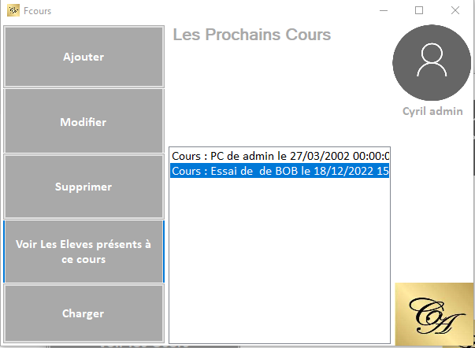

# Documentation de cbApp

Contexte : Pour faciliter la gestion des cours du cabinet, nous avons proposé à notre maitre de stage, une application C# permettant de gérer les cours d'anglais du jour avec un sysème d'authentification, afin que chaque personne du cabinet puissent utiliser le logiciel. 

## Base de données 
 ```sql
drop database if exists dbappcb;
Create database dbappcb;
use dbappcb;


Create Table user(
    id integer not null auto_increment,
    nom varchar(50),
    prenom varchar(50),
    mdp varchar(100),
    administrator boolean,
    primary key(id)
);

Create  Table cours(
    id integer not null auto_increment,
    nom varchar(100),
    idUser integer,
    ladate DateTime,
    primary key(id),
    foreign key (idUser) references user(id)
);

Create Table eleve(
    id integer not null auto_increment,
    nom varchar(50),
    prenom varchar(50),
    mail varchar(50),
    telephone varchar(10),
    primary key(id)
);

Create table participe (
    idCours integer not null,
    idEleve integer not null,
    primary key(idCours,idEleve),
    foreign key(idCours) references cours(id),
    foreign key(idEleve) references eleve(id)
);


insert into user (nom,prenom,mdp,administrator) values ('Cyril','admin','8296b82b0a068891c542086fe6f3a87d4c1de3536cf2c2f7d031872a10186ff1',1);
 ```
<br>

### Cas d'utilisations :


 Nous avons procédé, au hachage du mot de passe.

 Le mot passe admin en clair est Grizzli.

L'interface de connexion :

 

<br>

Je suis connecté en tant qu' administrateur.

J'ai le choix entre voir les cours du jour, voir les eleves ou les utilisateurs : 


<br>

Nous avons la liste des utilisateurs :

  

<br>

Nous allons ajouter un nouvel utilisateur :


<br>

Le nouvel utilisateur a bien été ajouté :


Nous revenons sur le menu principal et cliquons sur voir les cours :


Nous ajoutons un nouveau cours :


le cours a bien été ajouté :


Nous revenons sur le menu  principal et cliquons sur voir les elèves et cliquons sur ajouter :


<br>

<br>
 
 Nous pouvons voir les 2 élèves enregistrés, pour ajouter un nouvel élève cliquons sur Ajouter  :


Saisissons les informations :


<br>

Le nouvel élève a bien été ajouté :


En cliquant sur L'élève nous accèdons à sa fiche :


Nous revenons au menu principal et ajoutons cet élève au cours de Bob :




Nous cliquons sur ajouter, pour ajouter l'élève :


Chosissons Adam : 


L'élève a bien été inscrit :


Connectons nous en tant que Bob pour consulter ses cours.


Le cours du jour de Bob est "Essai de" pour le 18/12/2022 à 15 h :


Bob regarde les élèves de son cours, nous retrouvons Adam:


La fiche d'Adam :


Pour tester notre mot de passe, nous avons récupéré la somme de contrôle et mise sur Crackstation :


Le mot de passe admin a bien été retrouvé.

Pour remédier à cela, il faut premièrement sensibiliser les différents utilisateurs, pour qu'ils priviligienet des mots de passes forts. De plus nous allons procéder aus salage du mot de passe.


Le salage de mot de passe est une méthode pour rendre l'empreinte des mots de passe plus sûre en ajoutant aux mots de passe une chaîne de caractères aléatoires avant qu' ils soient hashés.

Le code permettant le salage, lors de la création d'un nouvel utilisateur :


Pour la phase de test nous hashons notre potentiel futur mot de passe :


La somme de contrôle du mot n'a pas été déterminée :


Code permettant le salage lors de l'authentification :


Tentative de connexion :


Résultat :


### Une base de données distante 

Le cloud computing est la pratique consistant à utiliser des serveurs informatiques à distance et hébergés sur internet pour stocker, gérer et traiter des données, plutôt qu'un serveur local ou un ordinateur personnel.


Pour la base de données de notre application nous avons décidé de faire appel au service de Azure.


Diagramme de classe :


L'offre :


Un noyau virtuel (vCore) représente l’UC logique disponible pour votre serveur, offerte avec un choix à opérer entre plusieurs générations de matériel. Pour les serveurs créés à l’aide de vCores de 4e génération, les vCores sont basés sur des processeurs Intel E5-2673 v3 (Haswell) 2,4 GHz. Pour les serveurs créés à l’aide de vCores de la génération actuelle (Gen5), les vCores sont basés sur des processeurs Intel E5-2673 V4 (Broadwell) 2,3 GHz, Intel SP8160 (Skylake) et Intel Xeon Platinum 8272CL 2,5 GHz (Cascade Lake).


Configuration matérielle :


Azure nous laisse la possibilitée de sauvegader et de les restaurer :


Azure propose un système d'archivage ce qui est parfait, pour la conservation dans la base active les données des clients et utilisateurs seront conservées pendant 2 ans maximum (sauf s’ils en demandent l’effacements).


Azure nous informe sur les vulnérabilités de notre serveur, afin que les corrigions. De plus elle détecte les comportements suspects comme des tentatives de force brute, injection SQl etc...


Azure intègre un système de journalisation ce qui est essentiel pour la traçabilité et l'imputabilité.

Imputabilité : désigne la possibilité d'attribuer la responsabilité d'un acte à une personne clairement identifiée.

traçabilité : La traçabilité permet de forunir un historique de l'utilisation d'un système d'information pour disposer d'une preuve des actions menées sur les données.


Azure propose différents chiffrement des données :

- TLS Pour les données en mouvement. 

- TDE protège les données au repos, c’est-à-dire les fichiers de données et les fichiers journaux. Il vous permet d’être en conformité avec de nombreuses lois, réglementations et directives établies dans différents secteurs d’activité.

Pour sécuriser une base de données utilisateur, vous pouvez prendre des précautions telles que :

1. Concevoir un système sécurisé.    
2. Chiffrer les ressources confidentielles.
3. Créer un pare-feu autour des serveurs de base de données.

- Always Encrypted est une fonctionnalité conçue pour protéger les données sensibles, telles que les numéros de carte de crédit ou les numéros d’identification nationaux (par exemple, les numéros de sécurité sociale américains), stockées dans Azure SQL Base de données, Azure SQL Managed Instance et SQL Server bases de données. Always Encrypted permet aux clients de chiffrer des données sensibles à l’intérieur des applications clientes et de ne jamais révéler les clés de chiffrement au moteur de base de données.


